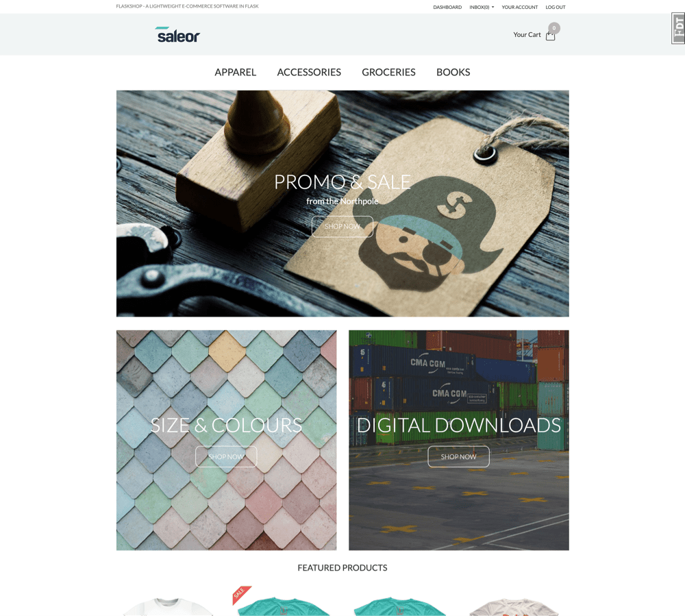
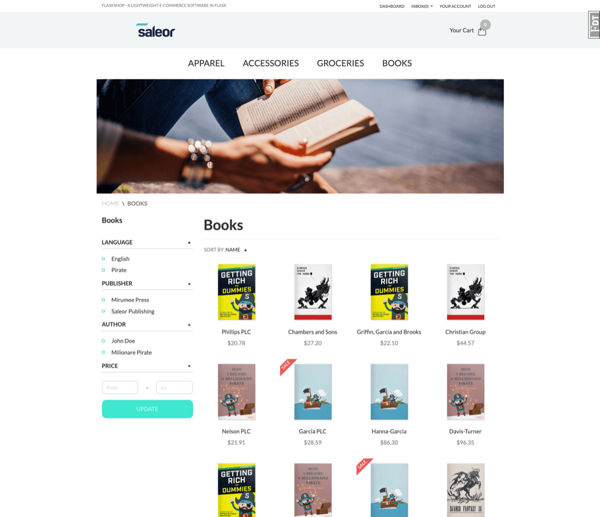
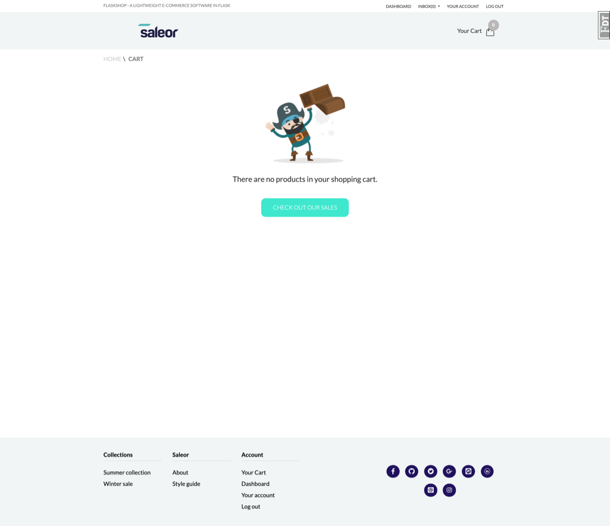
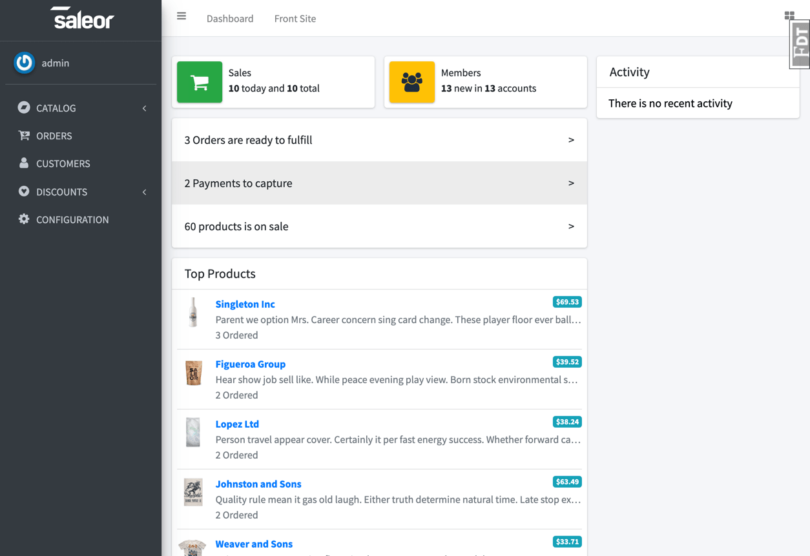
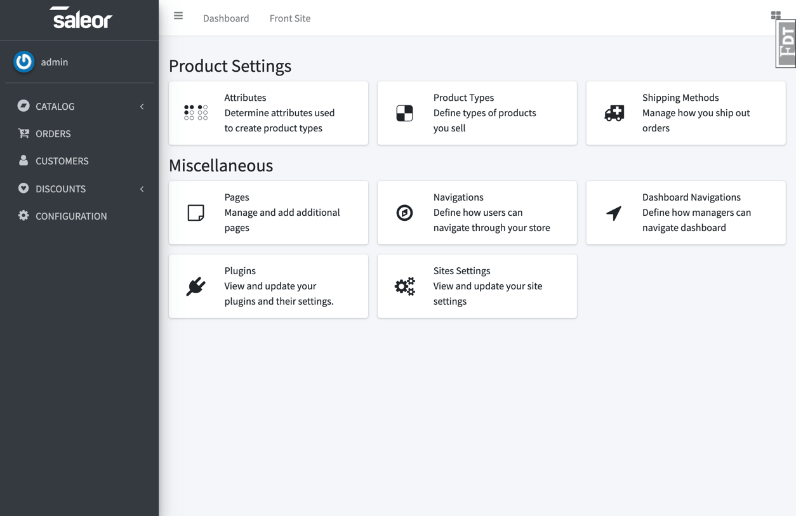
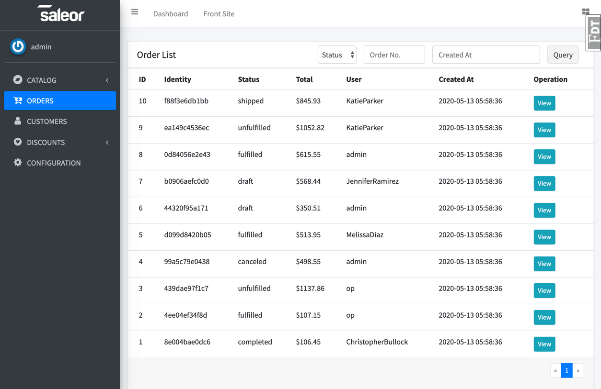

## Капча

Реализована капча в `flaskshop/captcha/forms.py`, в `flaskshop/templates/captcha` хранится jijna шаблон отображения страницы с капчей. 

Для создания изоображений была добавлена библиотека PIL.

Капча использует email адрес в качестве персональных данных: генерируется 8 изображений на каждом из которых содержится несколько последовательных символов из email адреса. 

1. Изоображения не сохраняются, а сразу переводятся в base64 (это избавляет от проблем с наименованием этих изоображений, и их последующем удалении после GET запроса).
2. Изоображения перетасовываются, после чего соответствующие изоображениям части email адреса добавляются последовательно в Redis базу данных с разделителем (её использование позволяет, в том числе, убирать "брошенные" пользователями капчи из БД по истечении времени).
3. Клиент получает base64-изоображения в перетасованном порядке.
4. Ответом клиента является перестановка чисел от 0 до 7 (включительно, числа разделены пробелом). Самих чисел пользователь, естественно, не видит, этим занимается код на стороне клиента.
5. Сервер, используя числа клиента и соответствие индекс-текст (из второго пункта), сравнивает полученный email адрес с реальным.

Решение об отправке капчи принимает `captcha_required` определённая в `flaskshop/captcha/views.py`. В текущей реализации капча будет показана, если у пользователя значение флага bot – True. Если на некой странице есть необходимость капчи, то её следует использовать `captcha_requeired` как декоратор (по аналогии с `login_required`):

```python
@login_required
@captcha_required
def test_pay(token):
    payment = create_payment(token, "testpay")
    payment.pay_success(paid_at=datetime.now())
    return redirect(url_for("order.payment_success"))
```

Далее ридми о сайте от разработчиков.

# Flask Shop - An Amazing Project


## Introduction
This project is a front page copy of [saleor](https://github.com/mirumee/saleor) old version, but written with flask. 
It hasn't completed yet.

## ScreenShot

<table align="center">
    <tr>
        <td align="center">
            <a href="https://raw.githubusercontent.com/hjlarry/flask-shop/master/ScreenShot/1.png">
                
            </a>
        </td>
        <td align="center">
            <a href="https://raw.githubusercontent.com/hjlarry/flask-shop/master/ScreenShot/2.png">
                
            </a>
        </td>
        <td align="center">
            <a href="https://raw.githubusercontent.com/hjlarry/flask-shop/master/ScreenShot/3.png">
                
            </a>
        </td>
    </tr>
    <tr>
        <td align="center">
            <a href="https://raw.githubusercontent.com/hjlarry/flask-shop/master/ScreenShot/4.png">
                
            </a>
        </td>
        <td align="center">
            <a href="https://raw.githubusercontent.com/hjlarry/flask-shop/master/ScreenShot/5.png">
                
            </a>
        </td>
        <td align="center">
            <a href="https://raw.githubusercontent.com/hjlarry/flask-shop/master/ScreenShot/6.png">
                
            </a>
        </td>
    </tr>
</table>


## Quickstart

### Use python virtual environment
**First, Clone and Install dependence**
```
git clone https://github.com/hjlarry/flask-shop.git
cd flask-shop
python3 -m venv .venv
# on windows, you should run .venv\Scripts\activate.bat 
source .venv/bin/activate
pip3 install -r requirements.txt
```

**Second, Init db and run**
```
# modify .flaskenv and flaskshop/setting.py
flask createdb
flask seed
flask run
```

### Use Docker 
**First, Build image and run in background**
```
docker-compose up -d
```
**Second, enter container and add fake data**
```
docker-compose exec web sh
flask createdb
flask seed
```
### About Config
The default admin account is:

username|password|role
---|---|---
admin|admin|super administrator
editor|editor|editor
op|op|operator

If the js files has been modified, you need to:
```
npm install
npm run build
```

Redis and Elasticsearch is unabled by default, You can enable them for good performence and search ablitity.


### Атака на капчу

Анализ капчи производится в папке `catpcha_analysis`. Ввиду некоторой разрознености иследования утилиты анализа оказались немного разбросанными. TODO: добавить python зависимости в Pipfile. Все скрипты являются скорее PoC, чем законченным ПО. Запуск всех `.py` файлов:
```
python3 filename.py
```

#### img2text

1. `captcha_generate.py` -- скрипт для генерации изображений (внутри настраиваемые параметры).
2. NN -- папка с двумя jupyter-notebook (для обучения и тестирования) вместе с моделью.
3. `method_*` -- реализация соответствующего метода. Для brutesearching есть реализация на golang (работает быстрее, паралельно).

Для работы метода teseract требуется установить teseract, удостоверится, что он есть в `$PATH`, а так же данные для его работы (подходит `eng.trainddata`).

##### text2img

1. `emails_faker.py` -- генерация базы имейлов с помощью библиотеки `faker` (псевдореальные адреса). `emails_gen.py` - генерация на основе популярных имен/доменов (предпочтительный метод).
2. `main.py` и `main.go` (реализуют одно и то же, реализация на golang быстрее) решают текстовый пазл (заданный пока в коде) с помощью растояния левенштейна (используются соответствующие библиотеки). В поле INPUT вводится распознанный из `In [47]` в `img2text/NN/model_test.ipynb` текст капчи. Для запуска 

